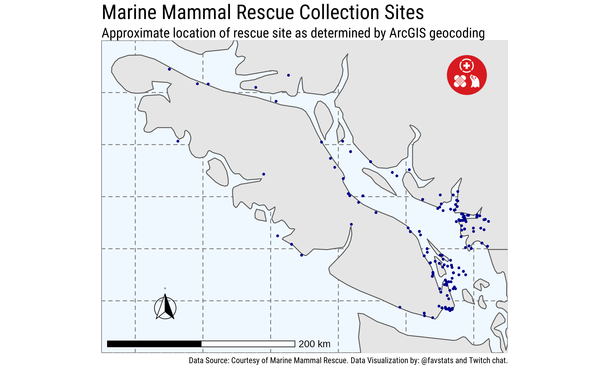

```{r, setup, echo=F}
knitr::opts_chunk$set(echo =F, message = F, warning = F)
```

The following maps have been created using animal patients data from the [Marine Mammal Rescue site](https://mmrpatients.org/) located in Vancouver, Canada. The data was accessed via the {[marinemammalrescue](https://github.com/kierisi/marinemammalrescue)} R package.

The data provides a column which includes the collection site of the animal. We take this variable and apply the [`tidygeocoder`](https://jessecambon.github.io/tidygeocoder/) R package to retrieve approximate longitude and latitude values of the collection site. 

This doesn't always work perfect but a first look seems to suggest it works good enough :)

There are two charts. The first chart is static, whereas the second one is interactive. 

## Static Map of Collection Sites




```{r}
library(leaflet)
library(tidyverse)

lab_mmr <- readRDS("data/lab_mmr.rds")
```


## Interactive Map of Collection Sites (using `leaflet`)

<center>

```{r}
m <- leaflet(lab_mmr) %>% 
    addTiles() %>% 
    addCircleMarkers(
      lng=~long, 
               lat=~lat, 
               fillOpacity = 1,
               stroke = F,
               fillColor = "#00bfff",
               radius = 5,
               label = ~lab)

m 
```

</center>


